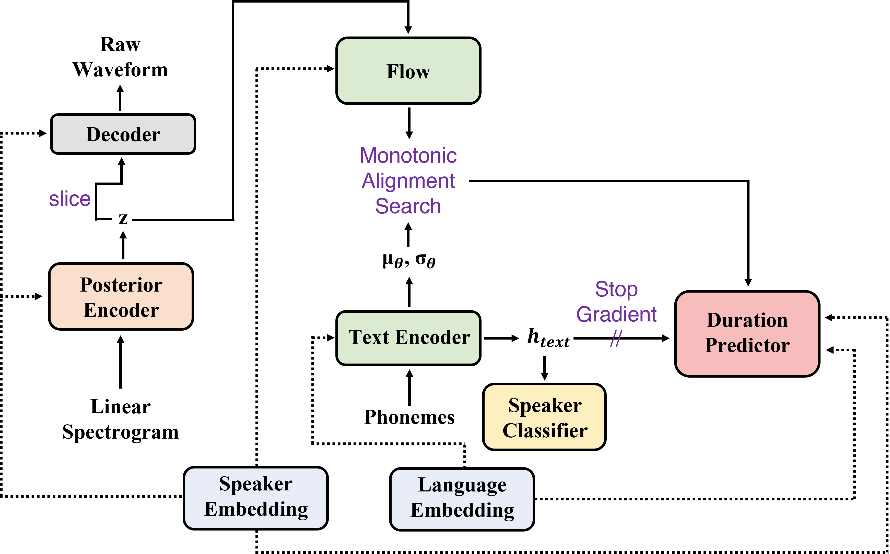
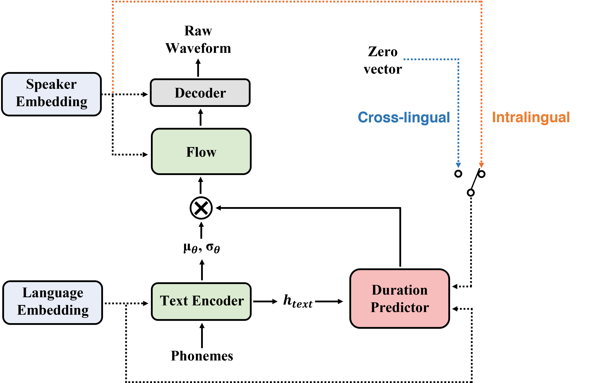

# SANE-TTS: Stable And Natural End-to-End Multilingual Text-to-Speech

**Authors:** Hyunjae Cho, Wonbin Jung, Junhyeok Lee, Sang Hoon Woo @[MINDsLab Inc.](https://maum.ai/)

**Abstract:** In this paper, we present SANE-TTS, a stable and natural end-to-end multilingual TTS model. By the difficulty of obtaining multilingual corpus for given speaker, training multilingual TTS model with monolingual corpora is unavoidable. We introduce speaker regularization loss that improves speech naturalness during cross-lingual synthesis as well as domain adversarial training, which is applied in other multilingual TTS models. Furthermore, by adding speaker regularization loss, replacing speaker embedding with zero vector in duration predictor stabilizes cross-lingual inference. With this replacement, our model generates speeches with moderate rhythm regardless of source speaker in cross-lingual synthesis. In MOS evaluation, SANE-TTS achieves naturalness score above 3.80 both in cross-lingual and intralingual synthesis, where the ground truth score is 3.99. Also, SANE-TTS maintains speaker similarity close to that of ground truth even in cross-lingual inference. Audio samples are available on [our web page](https://mindslab-ai.github.io/sane-tts/).

<!-- [Paper](https://arxiv.org/) -->

| Training Procedure                                     | Inference Procedure                                     |
| ------------------------------------------------------ | ------------------------------------------------------- |
|  |  |